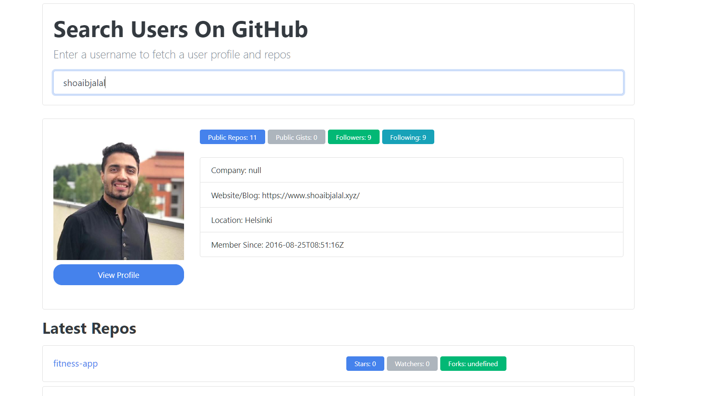

This GitHub user finder app is built with Vanilla_JavaScript using object oriented programming. UI of this app is done with Bootswatch css. 
User can make a request to github api to search for other users. This app is using promises and callbacks plus "async and await". "fetch" is used to get the data from github api.

To run the project, Download or clone it on your machine and open index.html on your browser.

